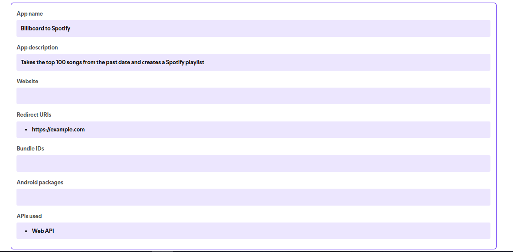

# The Song Time Machine 🎶

This project allows you to create a Spotify playlist of Billboard Hot 100 songs from a specific date in the past. It scrapes the Billboard website for song titles and uses the Spotify Web API to find and add these songs to a private playlist.

## Features
- **Web Scraping**: Retrieves the Billboard Hot 100 song list for a specified date.
- **Spotify Integration**: Authenticates with the Spotify API and creates a playlist with the Billboard songs.
- **Date-based Playlist**: Enter a date in the format `YYYY-MM-DD` to "time travel" to the top 100 songs of that day.

## Requirements
- Python 3.6 or higher
- A Spotify Developer account
- The following Python libraries:
  - `requests`
  - `BeautifulSoup` (part of `bs4`)
  - `spotipy`
  - `dotenv`

## Setup and Installation
1. **Clone the repository**:
   ```bash
   git clone https://github.com/your-username/The-Song-Time-Machine.git
   cd The-Song-Time-Machine
2. **Create a Virtual Environment**:
   ```bash
   python -m venv .venv
   source venv/bin/activate  # Linux/Mac
   .venv\Scripts\Activate.ps1  # Window
2. **Install Dependencies**: Use pip to install the required libraries
   ```bash
   pip install requirements.txt
3. **Spotify App Creditionals**:
   - Go to the [Spotify Developer Dashboard](https://developer.spotify.com/dashboard/) and create an application.
   
   - Obtain your **Client ID** and **Client Secret**.
5. **Environment Variables**:
   - Create a **".env"** file in the project root directory.
   - Add your Spotify API credentials to the .env file:
     ```bash
     CLIENT_ID = your_client_id
     CLIENT_SECRET = your_client_secret
## Usage and Installation
1. **Run the script**:
    ```bash
    python main.py
2. **Input the Date**: When prompted, enter the date for the Billboard chart you want to retrieve, in **YYYY-MM-DD** format.
3. **Playlist Creation**: The script will scrape the Billboard Hot 100 songs for the specified date and add them to a new private playlist in your Spotify account.
## Code Overview
1. **Scraping Billboard Hot 100 Data:**
 The script retrieves the top 100 songs for a specified date from the Billboard website using **requests** and **BeautifulSoup**.
2. **Spotify App Authentication:**
 The script authenticates with the Spotify API using **SpotifyOAuth** and retrieves the user's ID for playlist creation.
 3. **Searching for Songs on Spotify:**
 Each song title is searched on Spotify, and the URI of each track is saved if found.
4. **Creating and Populating the Playlist:**
A new playlist is created in the user's Spotify account, and the songs are added to it.

## Error Handling
If a song is not found on Spotify, the script will skip that song and display a message.\
**Example output**:

    Which year do you want to travel to? Enter the date in YYYY-MM-DD format: 1990-01-01
    200
    Song XYZ does not exist on Spotify. Skipped!
    Songs added to the playlist.
## Troubleshooting
- **Spotify Authentication Errors:** Make sure you have correctly set up your ".env" file and configured your Spotify Developer application with the correct redirect URI(set the redirect URL to **https://example.com**.
- **Scraping Errors:** If the Billboard website structure changes, the selectors may need to be updated.
## Contributing
Feel free to open issues or submit pull requests for improvements or bug fixes.
## Support
For support, email ayush0187cse@gmail.com or join our Slack channel.\
**Links**:\
[](https://www.linkedin.com/ayu014)

